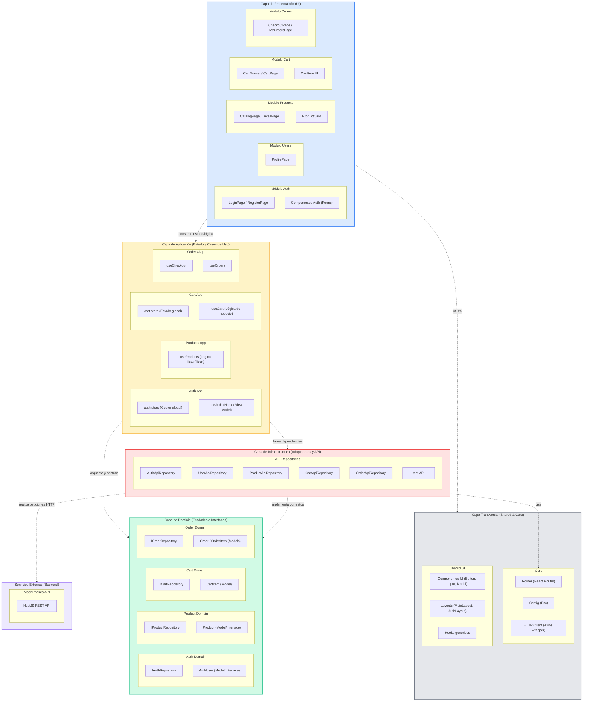
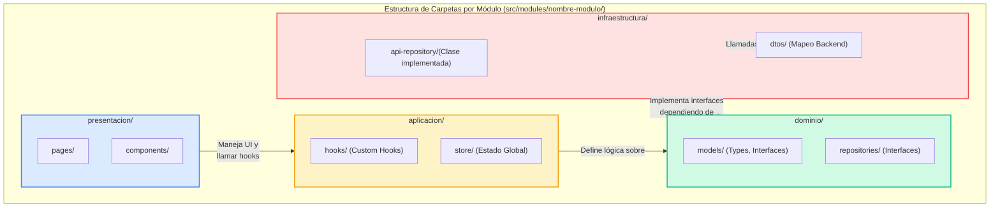

# Diagrama de Paquetes — Modelo Arquitectónico Frontend MoonPhases

## Diagrama de Paquetes del Sistema (Frontend)

La arquitectura del Frontend sigue un modelo **Modular Clean Architecture** (o Feature-Sliced Design). Se ha estructurado dividiendo el proyecto en los mismos módulos de negocio que el Backend, garantizando un acoplamiento coherente y mantenible. 



---

## Diagrama del Patrón Interno por Módulo (Frontend)

Cada módulo en el frontend (ej. *Auth*, *Products*, *Cart*) replica una estructura interna consistente para aislar la lógica y la UI.



---

## Guía para Recrear en Draw.io (Modelo Frontend)

### 1. Convenciones Visuales de Capas

| Capa | Fill (fondo) | Stroke (borde) | ¿Qué incluye en Frontend? |
|---|---|---|---|
| Presentación | Azul claro (`#DBEAFE`) | Azul (`#3B82F6`) | Componentes React, Páginas, Assets |
| Compartido (Shared) | Gris claro (`#E5E7EB`) | Gris (`#6B7280`) | UI Components base, Config, Cliente HTTP (Axios) |
| Aplicación | Amarillo claro (`#FEF3C7`) | Amarillo (`#F59E0B`) | Hooks que manejan UseCases (React Query/SWR), Estado Global (Zustand, Context) |
| Dominio | Verde claro (`#D1FAE5`) | Verde (`#10B981`) | Interfaces TypeScript, Entidades de negocio, Contratos |
| Infraestructura | Rojo claro (`#FEE2E2`) | Rojo (`#EF4444`) | Fetch/Axios API Repositories, DTOs de adaptadores |
| External (Backend) | Púrpura claro (`#EDE9FE`) | Púrpura (`#8B5CF6`) | App NestJs |

### 2. Estructura recomendada para el Canvas

1. Crear paquetes organizados verticalmente (Presentación arriba, Dominio, Infraestructura abajo).
2. Dejar el bloque `Shared / Core` a la derecha de la capa de presentación (como soporte).
3. Utiliza la herramienta UML → **Package** para envolver el modelo, y usa **Dashed Arrows** (líneas punteadas) para indicar las llamadas y usos inter-capas.

### 3. La Estructura de Folders Implementada

La base de carpetas que ya se encuentra creada en el proyecto para seguir esta arquitectura en `./src` es:
```text
src/
├── core/
│   ├── config/ (variables del entorno, etc.)
│   ├── http/ (cliente axios base)
│   └── routes/ (configurador principal de las vistas)
├── shared/
│   ├── components/ (ej: botones reusables)
│   ├── hooks/ (comunes)
│   ├── layouts/ (Navbar, Footer, etc.)
│   └── utils/ (formatters, validadors base)
└── modules/
    ├── auth/ -> (domain, application, infrastructure, presentation)
    ├── users/ -> (domain, application, infrastructure, presentation)
    ├── products/ -> (domain, application, infrastructure, presentation)
    ├── categories/ -> (domain, application, infrastructure, presentation)
    ├── cart/ -> (domain, application, infrastructure, presentation)
    ├── coupons/ -> (domain, application, infrastructure, presentation)
    ├── shipping/ -> (domain, application, infrastructure, presentation)
    └── orders/ -> (domain, application, infrastructure, presentation)
```
