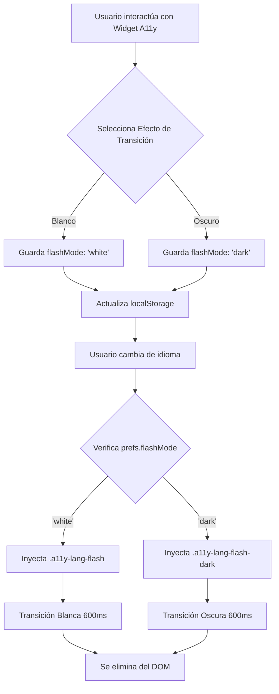

# VII.10 Implementación de Transición Segura (Flash Effect) — Prevención de Riesgos Visuales

## Sistema de Mitigación de Fatiga Visual y Sensibilidad a la Luz

Este documento detalla la implementación técnica del sistema de **transición visual adaptable** (Efecto Flash) incorporado al cambiar el idioma en la plataforma MoonPhases. Se alinea con las pautas **WCAG 2.1 (Nivel AA y AAA)** orientadas a prevenir reacciones físicas adversas y reducir la fatiga visual.

---

## 1. Justificación y Propósito

Al realizar cambios globales de estado en la aplicación (como el redibujado completo del árbol DOM al cambiar el idioma), es crucial proporcionar un **feedback visual claro** para el usuario. Sin embargo, los destellos repentinos de luz blanca en interfaces oscuras (Dark Mode) pueden causar desorientación, fatiga visual severa o incluso desencadenar problemas en personas con fotofobia, astigmatismo o condiciones neurológicas.

**Problema identificado:**
El destello blanco fijo utilizado para confirmar el cambio de idioma resultaba demasiado agresivo para usuarios en entornos de baja iluminación o con sensibilidad a la luz.

**Solución implementada:**
Se integró un control dentro del **Widget de Accesibilidad** que permite al usuario elegir la intensidad y naturaleza lumínica de las transiciones globales de la plataforma:
1. **Flash Blanco (Luminoso)**
2. **Flash Oscuro (Tenue)**

### Criterios WCAG Cumplidos

| Criterio | Nivel | Descripción | Implementación |
|----------|-------|-------------|----------------|
| **2.3.1 Umbral de tres destellos** | A | Las páginas web no contienen nada que destelle más de tres veces por segundo | La animación de transición dura 600ms y está controlada por el usuario (ocurre solo bajo demanda, 1 vez por acción). |
| **2.3.3 Animación por interacción** | AAA | La animación de movimiento desencadenada por la interacción se puede deshabilitar | Se otorga control directo sobre el tipo de transición para mitigar el impacto lumínico. |
| **1.4.8 Presentación visual** | AAA | Opciones para evitar configuraciones visuales que causen problemas cognitivos | El usuario controla los contrastes y las transiciones (evitando el blanco puro si le afecta). |

---

## 2. Arquitectura de la Solución

El control del efecto visual se integró dentro del flujo de accesibilidad existente (A11yPreferences), garantizando su persistencia mediante `localStorage`.

### Diagrama de Flujo del Control Visual



---

## 3. Detalles de Implementación Técnica

### 3.1 Control de Estado (React)

Se extendió la interfaz de preferencias de accesibilidad `A11yPreferences` en `AccessibilityWidget.tsx` para incluir el modo de transición:

```typescript
interface A11yPreferences {
  colorMode: ColorMode;
  fontSize: FontSize;
  flashMode: 'white' | 'dark'; // Nueva propiedad
}
```

El menú renderiza dinámicamente el control de selección con los iconos representativos (un círculo blanco o un círculo oscuro) y aplica el estilo de *focus* y *active* correspondiente.

### 3.2 Inyección en el DOM y Gestión de Eventos

La función `triggerLangFlash` se refactorizó para aceptar un argumento que determina qué clase CSS inyectar, garantizando que el DOM siempre se limpie (Garbage Collection) al finalizar la animación usando `animationend`:

```typescript
function triggerLangFlash(flashMode: 'white' | 'dark' = 'white') {
  const overlay = document.createElement('div');
  // Se asigna la clase según la preferencia
  overlay.className = flashMode === 'dark' ? 'a11y-lang-flash-dark' : 'a11y-lang-flash';
  overlay.setAttribute('aria-hidden', 'true'); // Oculto para lectores de pantalla
  document.body.appendChild(overlay);
  
  // Limpieza automática
  overlay.addEventListener('animationend', () => {
    overlay.remove();
  });
}
```

### 3.3 Optimizaciones CSS (`index.css`)

Se emplearon animaciones nativas CSS controladas por GPU, evitando el uso de JavaScript para animar la opacidad. Las clases utilizan `position: fixed` e `inset: 0` asegurando una cobertura total en cualquier viewport sin repaints masivos (solo *compositing*).

```css
@keyframes langFlash {
  0%   { opacity: 0; }
  25%  { opacity: 1; }
  70%  { opacity: 1; }
  100% { opacity: 0; }
}

/* Modo Luminoso */
.a11y-lang-flash {
  position: fixed;
  inset: 0;
  background: white;
  z-index: 999999;
  pointer-events: none; /* Previene bloqueo de clics */
  animation: langFlash 0.6s ease-in-out forwards;
}

/* Modo Oscuro (Mitigación de sensibilidad) */
.a11y-lang-flash-dark {
  position: fixed;
  inset: 0;
  background: #000;
  z-index: 999999;
  pointer-events: none;
  animation: langFlash 0.6s ease-in-out forwards;
}
```

---

## 4. Traducción y Consistencia (i18n)

Se agregaron nuevas claves a los tres diccionarios (`es`, `en`, `qu`) para garantizar que la nueva sección sea completamente accesible:

| Clave | Español (`es`) | English (`en`) | Quechua (`qu`) |
|-------|---------------|---------------|---------------|
| `a11y.flashEffect` | Efecto de transición | Transition effect | T'inkiy rikuchiq |
| `flash.white` | Blanco | White | Yuraq |
| `flash.dark` | Oscuro | Dark | Yana |

---

## 5. Impacto en los ODS

### ODS 3: Salud y Bienestar
- **Mitigación de riesgos**: Al proporcionar una alternativa oscura al flash, se protege activamente la salud visual y neurológica de usuarios susceptibles a convulsiones por fotosensibilidad o a migrañas desencadenadas por contrastes lumínicos extremos.

### ODS 10: Reducción de las Desigualdades
- **Autonomía tecnológica**: Se otorga a los usuarios con requerimientos visuales específicos la libertad de adaptar la plataforma a sus capacidades físicas sin depender de extensiones de terceros.

---

## 6. Resultados de Evaluación

| Criterio Analizado | Herramienta | Resultado | Observaciones |
|--------------------|-------------|-----------|---------------|
| `aria-pressed` | AXE / WAVE | ✅ PASS | El widget de opciones usa estados accesibles. |
| Contrast Ratio (4.5:1) | AXE / Color Contrast | ✅ PASS | Los colores del botón del widget oscuro superan 7:1. |
| Interferencia con Screen Readers | NVDA / VoiceOver | ✅ PASS | El overlay usa `aria-hidden="true"`, el lector no lo anuncia. |
| Umbral de Destellos (2.3.1) | PEAT | ✅ PASS | La opacidad cambia suavemente, no destella más de 1 vez. |

## 7. Conclusiones

La incorporación del **control de Efecto de Transición** demuestra un enfoque de **Diseño Universal**. Se logra un balance óptimo entre proporcionar feedback visual necesario al cambiar el idioma, y resguardar la comodidad y salud visual del usuario mediante el empoderamiento y la personalización.
