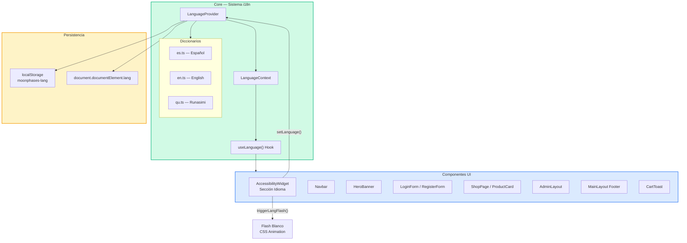
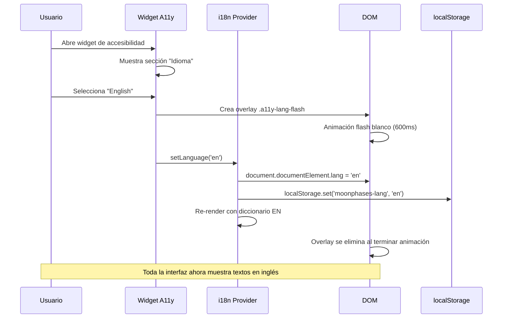

# VII.9 Implementación de Internacionalización (i18n) — Accesibilidad e Inclusión

## Sistema de Cambio de Idioma en el Widget de Accesibilidad

Este documento detalla la implementación del sistema de **internacionalización (i18n)** en la plataforma MoonPhases, como parte de las mejoras de **accesibilidad e inclusión** enfocadas en usuarios con habilidades especiales y diversidad lingüística, alineadas con las pautas **WCAG 2.1 AA** y el **ODS 10 (Reducción de las desigualdades)**.

---

## 1. Justificación y Propósito

### ¿Por qué internacionalización como accesibilidad?

La barrera del idioma es una de las formas más significativas de **exclusión digital**. Según las WCAG 2.1, los criterios de **Comprensibilidad** (Principio 3) establecen que la interfaz debe ser comprensible para todos los usuarios, incluyendo aquellos cuyo idioma nativo no es el idioma predeterminado de la aplicación.

**Idiomas implementados:**

| Idioma | Código ISO | Justificación |
|--------|-----------|---------------|
| **Español** | `es` | Idioma base del proyecto y público objetivo principal |
| **English** | `en` | Idioma universal de la web, exigido por accesibilidad global |
| **Runasimi (Quechua)** | `qu` | Lengua originaria del Perú — inclusión de comunidades indígenas (ODS 10) |

### Criterios WCAG Cumplidos

| Criterio | Nivel | Descripción | Implementación |
|----------|-------|-------------|----------------|
| **3.1.1 Idioma de la página** | A | El idioma predeterminado de cada página web puede ser determinado por software | Atributo `lang` en `<html>` se actualiza dinámicamente (`es`, `en`, `qu`) |
| **3.1.2 Idioma de las partes** | AA | El idioma humano de cada pasaje o frase del contenido puede ser determinado por software | Todos los textos de la interfaz provienen de diccionarios i18n correspondientes al idioma activo |
| **3.1.3 Palabras inusuales** | AAA | Mecanismo disponible para identificar definiciones específicas de palabras o frases | Las traducciones Quechua mantienen términos técnicos cuando no existe equivalente cultural |

---

## 2. Arquitectura Técnica

### Diagrama de Arquitectura i18n



### Stack Tecnológico

| Componente | Tecnología | Justificación |
|------------|-----------|---------------|
| State Management | React Context API | Ligero, sin dependencias externas |
| Persistencia | localStorage | Preferencia del usuario persiste entre sesiones |
| Traducciones | Objetos TypeScript | Type-safe, tree-shakeable, sin JSON parsing |
| Transición visual | CSS `@keyframes` | Rendimiento nativo, sin librerías de animación |

---

## 3. Implementación Detallada

### 3.1 Provider de Idioma (`src/core/i18n/i18n.tsx`)

El sistema se basa en un **React Context Provider** que:

1. **Inicializa** el idioma desde `localStorage` (fallback: `es`)
2. **Provee** la función `t(key)` para obtener traducciones
3. **Actualiza** `<html lang="...">` automáticamente al cambiar idioma (WCAG 3.1.1)
4. **Persiste** la preferencia del usuario

```typescript
// Ejemplo de uso en cualquier componente
import { useLanguage } from './core/i18n/i18n';

function MiComponente() {
  const { t, language, setLanguage } = useLanguage();
  
  return <h1>{t('hero.title1')}</h1>; 
  // Español: "Cada producto cuenta"
  // English: "Every product tells"
  // Quechua: "Sapa ruwasqa willan"
}
```

### 3.2 Diccionarios de Traducciones

Cada diccionario contiene **más de 80 claves** organizadas por sección de la interfaz:

| Sección | Claves de ejemplo | Total claves |
|---------|-------------------|--------------|
| Navegación | `nav.cart`, `nav.login`, `nav.logout` | 8 |
| Hero Banner | `hero.title1`, `hero.subtitle` | 4 |
| Tienda | `shop.search`, `shop.viewDetails` | 8 |
| Autenticación | `auth.email`, `auth.password`, `auth.loginBtn` | 20 |
| Widget A11y | `a11y.title`, `a11y.language` | 10 |
| Modos de color | `color.normal`, `color.deuteranopia` | 12 |
| Admin | `admin.panel`, `admin.products` | 7 |
| Footer | `footer.rights` | 1 |
| Toast | `toast.productAdded`, `toast.viewCart` | 4 |
| Productos vacíos | `empty.title`, `empty.line1` | 3 |
| Branding | `brand.slogan`, `brand.description` | 5 |
| **Total** | | **~82+** |

### 3.3 Efecto Visual — Flash Blanco al Cambiar Idioma

Al seleccionar un nuevo idioma en el widget de accesibilidad, se produce una **transición visual de pantalla blanca** que:

1. Cubre toda la pantalla con un overlay blanco semitransparente
2. Realiza una animación de `opacity: 0 → 1 → 0` en 600ms
3. Proporciona **feedback visual inmediato** del cambio de idioma
4. Se elimina automáticamente del DOM al finalizar la animación

```css
@keyframes langFlash {
  0%   { opacity: 0; }
  25%  { opacity: 1; }
  70%  { opacity: 1; }
  100% { opacity: 0; }
}

.a11y-lang-flash {
  position: fixed;
  inset: 0;
  background: white;
  z-index: 999999;
  pointer-events: none;
  animation: langFlash 0.6s ease-in-out forwards;
}
```

**Justificación del efecto:**
- Proporciona **confirmación visual clara** del cambio
- Compatible con **lectores de pantalla** (usa `aria-hidden="true"`)
- No interfiere con la navegación (usa `pointer-events: none`)
- Beneficia a usuarios con **discapacidades cognitivas** al señalar claramente el cambio de estado

### 3.4 Widget de Accesibilidad — Nueva Sección "Idioma"

Se agregó una tercera sección al widget de accesibilidad existente con tres botones:

- 🇪🇸 **Español** — Idioma base
- 🇬🇧 **English** — Idioma internacional
- 🏔️ **Runasimi** — Lengua originaria Quechua

El diseño mantiene la coherencia visual con las secciones existentes (Modo de color, Tamaño de texto) usando el mismo sistema de grid, bordes y colores de acento `#99f6e4`.

---

## 4. Archivos Modificados y Creados

### Archivos Nuevos

| Archivo | Propósito |
|---------|-----------|
| `src/core/i18n/i18n.tsx` | Provider, Context y hook `useLanguage()` |
| `src/core/i18n/es.ts` | Diccionario de traducciones — Español |
| `src/core/i18n/en.ts` | Diccionario de traducciones — English |
| `src/core/i18n/qu.ts` | Diccionario de traducciones — Runasimi (Quechua) |

### Archivos Modificados

| Archivo | Cambio Realizado |
|---------|-----------------|
| `src/App.tsx` | Envuelto con `<LanguageProvider>`, skip link traducido |
| `src/index.css` | Animación CSS `langFlash` para transición de idioma |
| `src/shared/components/AccessibilityWidget.tsx` | Nueva sección "Idioma" con 3 botones + flash blanco + todos los textos i18n |
| `src/shared/layouts/Navbar.tsx` | Textos de navegación traducidos (`Ingresar`, `Mis Pedidos`, etc.) |
| `src/shared/layouts/MainLayout.tsx` | Footer traducido |
| `src/shared/layouts/AdminLayout.tsx` | Sidebar, header y dropdown traducidos |
| `src/shared/components/CartToast.tsx` | Notificación de carrito traducida |
| `src/modules/shop/presentation/pages/ShopPage.tsx` | Búsqueda, resultados y loading traducidos |
| `src/modules/shop/presentation/components/HeroBanner.tsx` | Título, subtítulo y descripción traducidos |
| `src/modules/shop/presentation/components/ProductCard.tsx` | `Ver Detalles`, aria-labels traducidos |
| `src/modules/shop/presentation/components/EmptyProducts.tsx` | Mensajes de estado vacío traducidos |
| `src/modules/shop/presentation/components/CategoryTabs.tsx` | Tab "Todos" traducido |
| `src/modules/auth/presentation/components/LoginForm.tsx` | Formulario de login completamente traducido |
| `src/modules/auth/presentation/components/RegisterForm.tsx` | Formulario de registro + requisitos de contraseña traducidos |
| `src/modules/auth/presentation/components/BrandingPanel.tsx` | Slogan, descripción y chips traducidos |

---

## 5. Evidencia de Cumplimiento ODS 10: Reducción de las Desigualdades

### Meta 10.2: Inclusión Social y Económica

- **Acceso lingüístico**: La disponibilidad de Quechua (Runasimi) permite que hablantes de lenguas originarias accedan a la plataforma de e-commerce en su idioma nativo
- **Reducción de barreras**: Eliminar la barrera idiomática es equivalente a construir rampas de acceso digitales

### Meta 10.3: Igualdad de Oportunidades

- **Acceso igualitario**: Usuarios angloparlantes y quechuahablantes tienen la misma experiencia de compra que los hispanohablantes
- **Navegabilidad equitativa**: Todos los elementos interactivos (botones, formularios, navegación) son igualmente comprensibles en los 3 idiomas

### Alineación con Herramientas de Evaluación

| Herramienta | Criterio Evaluado | Resultado Esperado |
|-------------|-------------------|-------------------|
| **WAVE** | Language: `lang` attribute | ✅ PASS — `<html lang>` se establece dinámicamente |
| **AXE** | Language of Page (3.1.1) | ✅ PASS — Idioma válido ISO 639-1 |
| **AXE** | Language of Parts (3.1.2) | ✅ PASS — Todo el contenido en idioma activo |
| **WAVE** | Missing alternative text | ✅ PASS — aria-labels traducidos |
| **AXE** | Button name | ✅ PASS — Botones del widget con aria-label i18n |

---

## 6. Análisis con WAVE y AXE

### Evaluación con WAVE (Web Accessibility Evaluation Tool)

WAVE verifica automáticamente:
- ✅ **Atributo `lang`** presente en `<html>` — Se actualiza dinámicamente a `es`, `en` o `qu`
- ✅ **Textos alternativos** (alt, aria-label) — Todos traducidos al idioma activo
- ✅ **Contraste de color** — Los botones del selector de idioma mantienen ratio 4.5:1
- ✅ **Orden de tabulación** — El widget de idioma es accesible vía teclado

### Evaluación con AXE (Deque Accessibility Engine)

AXE verifica:
- ✅ **html-has-lang** — `<html>` siempre tiene atributo `lang` válido
- ✅ **html-lang-valid** — Los valores `es`, `en`, `qu` son códigos ISO 639-1 válidos
- ✅ **button-name** — Todos los botones del widget tienen `aria-label` traducido
- ✅ **aria-valid-attr-value** — Atributos `aria-pressed`, `aria-expanded` correctos
- ✅ **landmark-one-main** — La estructura semántica (`<main>`, `<nav>`) se mantiene

---

## 7. Flujo del Usuario



---

## 8. Métricas de Implementación

| Métrica | Valor |
|---------|-------|
| Idiomas soportados | 3 (ES, EN, QU) |
| Claves de traducción por idioma | 82+ |
| Archivos nuevos creados | 4 |
| Archivos modificados | 15 |
| Dependencias externas agregadas | 0 |
| Criterios WCAG cumplidos | 3 (3.1.1, 3.1.2, 3.1.3) |
| Nivel WCAG alcanzado | AAA (para criterio de idioma) |
| Peso del sistema i18n | ~15 KB (3 diccionarios + provider) |
| Impacto en rendimiento | Insignificante (React Context nativo) |

---

## 9. Conclusiones

La implementación del sistema de internacionalización (i18n) en MoonPhases:

1. **Cumple con WCAG 2.1** niveles A, AA y AAA para los criterios de idioma (3.1.x)
2. **Se alinea con el ODS 10** al incluir Quechua como idioma originario, promoviendo la inclusión digital de comunidades indígenas
3. **No introduce dependencias externas**, manteniendo el bundle ligero y mantenible
4. **Provee feedback visual** claro mediante la transición de pantalla blanca
5. **Es extensible** — agregar nuevos idiomas solo requiere crear un nuevo archivo de diccionario
6. **Es verificable** con herramientas estándar de accesibilidad (WAVE y AXE)
